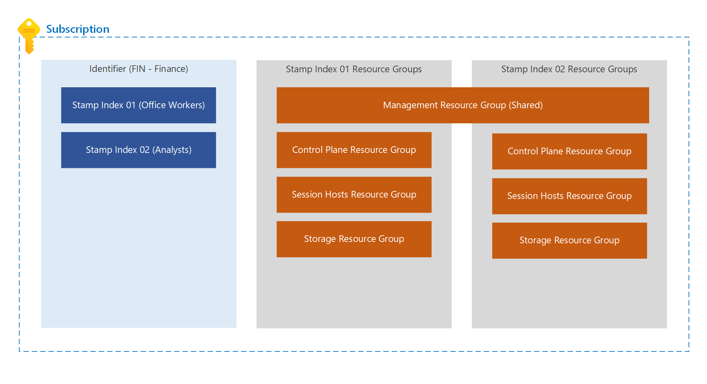

# Azure Virtual Desktop Solution

[**Home**](../README.md) | [**Features**](./features.md) | [**Design**](./design.md) | [**Prerequisites**](./prerequisites.md) | [**Troubleshooting**](./troubleshooting.md)

## Design

This Azure Virtual Desktop (AVD) solution will deploy a fully operational AVD [stamp](https://learn.microsoft.com/azure/architecture/patterns/deployment-stamp) in an Azure subscription. The "StampIndex" parameter in this solution allows each stamp to be identified and scale to the capacity of a single subscription. Either several small stamps or one large stamp could be deployed in one subscription. To uniquely name multiple, unrelated stamps within a subscription, input a unique value for the "Identifier" parameter in each deployment.  To name multiple related stamps, use the same value for the "Identifier" but increment the "StampIndex" across your subscriptions.

When the same "Identifier" is used but the "StampIndex" is incremented across the same subscription, the management resource group is uniquely named so the resource group and its resources are only deployed once. This enables the sharing of resources within the same "Identifier".  The "Identfier" is meant to represent a business unit or project within an organization.

The code is idempotent, allowing you to scale storage and sessions hosts, but the core management resources will persist and update for an subsequent deployments. Some of those resources are the host pool, application group, and log analytics workspace. See the diagram below for more details about the resources deployed in this solution:

Both a personal or pooled host pool can be deployed with this solution. Either option will deploy a desktop application group with a role assignment. Selecting a pooled host pool will deploy the required resources and configurations to fully enable FSLogix. This solution also automates many of the features that are usually enabled manually after deploying an AVD host pool.  See the [features](./features.md) page for more details.

With this solution you can scale up to Azure's subscription limitations. This solution has been updated to allow sharding. A shard provides additional capacity to an AVD stamp. See the options below for increasing network or storage capacity.

## Sharding to Increase Storage Capacity

To add storage capacity to an AVD stamp, the "StorageIndex" and "StorageCount" parameters should be modified to your desired capacity. The last two digits in the name for the chosen storage solution will be incremented between each deployment. The "VHDLocations" setting will include all the file shares. The "SecurityPrincipalIds" and "SecurityPrincipalNames" will have an RBAC assignment and NTFS permissions set on one storage shard per stamp. Each user in the stamp should only have access to one file share. When the user accesses a session host, their profile will load from their respective file share.
